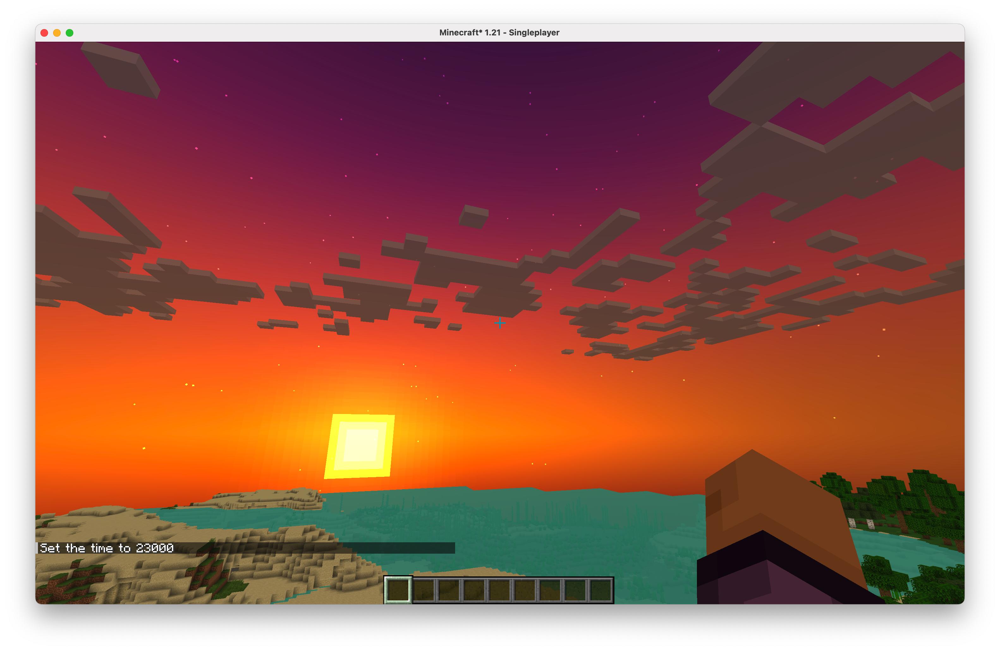

Simple Minecraft Shader (OptiFine/Iris)

Features
- Water: soft translucent green, gentle waves, Fresnel reflections
- Rain: subtle puddle gloss and screen-space reflections on flat ground
- Sky: fully procedural day/night gradient with a multi-band sunset/dusk wash (seamless horizon, no vanilla seam)

Install
- Copy the `mc-shader` directory (or zip its contents) into your shaderpacks folder.
- Select it in OptiFine or Iris.

Notes
- This pack uses a lightweight composite pass for reflections and sky tint.
- Reflections are approximate (simple SSR), tuned for clarity over realism.
